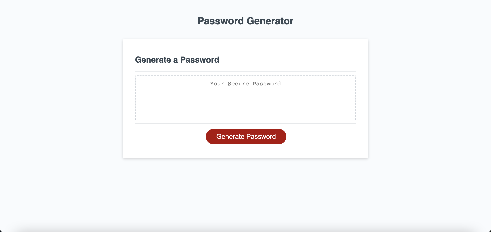

# Password-Generator

This assignment asked us to create an application that created a password based on selected criteria. The criteria included uppercase characters, lowercase characteres, numeric characters, and special characters. 

https://github.com/briantaelee/Password-Generator
https://briantaelee.github.io/Password-Generator/